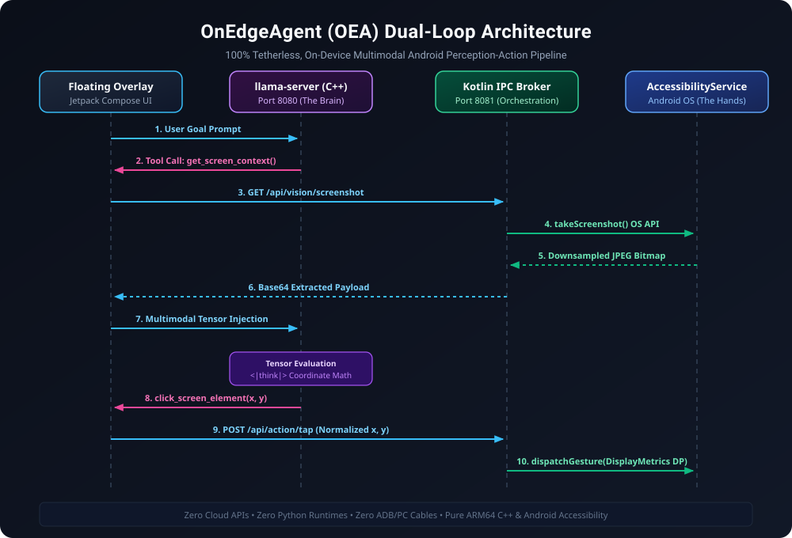

# 📱 OnEdgeAgent (OEA): Autonomous Edge AI Framework

OnEdgeAgent (OEA) is a zero-dependency, 100% on-device multimodal agent architecture for Android. By eliminating external Python servers and cloud APIs, OEA establishes a fully local, self-contained vision-to-action control loop. It relies on a statically compiled C++ `llama-server` runtime combined with a Kotlin `AccessibilityService` via dual-loop IPC to autonomously read the screen, plan actions, and execute physical UI taps natively on the device.

---

## 🚀 Quick Start (Latest Release)

For users and researchers who want to test the agent without building from source, follow these steps to install the latest pre-compiled release.

1. **Download the APK:** 
   Navigate to the Releases tab and download the latest `OnEdgeAgent-vX.X.X.apk`.

2. **Install the Application:** 
   Install the APK on your Android device (Android 11 / API 30+ required).

3. **Download Required Models:**
   * Download the main LLM: `gemma-4-E2B-it-Q4_K_M.gguf`
   * Download the multimodal projector: `mmproj-F16.gguf`
   * Place both files into the app's external files directory on your device: 
     `/storage/emulated/0/Android/data/com.example.onedgeagent/files/`

4. **Enable Accessibility:** 
   Go to **Settings > Accessibility > Downloaded apps > OnEdgeAgent** and toggle the service to **ON**. 
   *(Note: If sideloaded, you must first allow restricted settings under the app's info page).*

---

## 🧠 System Architecture



---

## ✨ Key Technical Innovations

* **Scoped Storage File Descriptor Forwarding:** 
  Bypasses complex Android native file I/O limits by utilizing `/proc/self/fd/` forwarding. This allows the raw C++ `llama-server` binary to seamlessly read `.gguf` model files located in `getExternalFilesDir()`.

* **Small Model Action Steering:** 
  Implements fine-tuned tool calling utilizing `<|think|>` channel suppression for `gemma-4-E2B-it`. This enforces deterministic JSON structural generation despite extremely constrained token generation limits on Edge devices.

* **Dynamic WindowManager Handling:** 
  Achieves seamless focus-stealing transitions utilizing `FLAG_NOT_FOCUSABLE` toggles on a persistent `WindowManager` overlay. This allows the agent chat ball to summon the soft keyboard (IME) when tapped, and instantly yield touch events to the background OS when collapsed.

* **DisplayMetrics Coordinate Scaling:** 
  Utilizes absolute fractional scaling to transform the model's normalized `(0.0 - 1.0)` coordinate predictions into physical pixel matrices via `Resources.getSystem().displayMetrics`. This bypasses localized Window inset padding for perfect physical precision.

---

## 💻 Build from Source (For Developers)

### Hardware Requirements
* **Processor:** ARM64-v8a (Snapdragon 8 Gen 1+ recommended for acceptable generation speeds)
* **RAM:** 8 GB minimum
* **OS:** Android 11+ (API 30+)

### Build Instructions

1. **Clone the Repository:**
   ```bash
   git clone https://github.com/shubhendam/OnEdgeAgent.AI.git
   cd OnEdgeAgent.AI
   ```

2. **Download the C++ Native Binary:**
   * Navigate to the **Releases** tab of this repository.
   * Download the pre-compiled `llama-server` binary.
   * Place the downloaded file into this exact directory inside the project before building: 
     `app/src/main/assets/arm64-v8a/llama-server`.

3. **Build the APK:** 
   Open the project in Android Studio or build via the Gradle wrapper:
   ```bash
   ./gradlew assembleRelease
   ```

---

## 📊 Empirical Benchmarks

* **Initial Image Tensor Evaluation:** 
  ~106s on modern mobile CPUs for a 720p heavily compressed JPEG. This is highly dependent on specific hardware and thread allocations.

* **Action Execution Latency:** 
  Sub-second response time (~50-100ms) measured from Tool Call parsing to the `dispatchGesture` physical tap on the display panel.

* **Memory Footprint:** 
  ~2.1 GB overhead for a Q4_K_M quantized Gemma model actively holding context.

---

## 📝 Citation

If you utilize OnEdgeAgent in your academic research, please cite our project:

```bibtex
@misc{onedgeagent2026,
  author = {Shubhendam},
  title = {OnEdgeAgent (OEA): A Novel Framework for Hosting Autonomous Edge AI Agents on Android},
  year = {2026},
  publisher = {GitHub},
  journal = {GitHub repository},
  howpublished = {\url{https://github.com/shubhendam/OnEdgeAgent.AI}}
}
```
